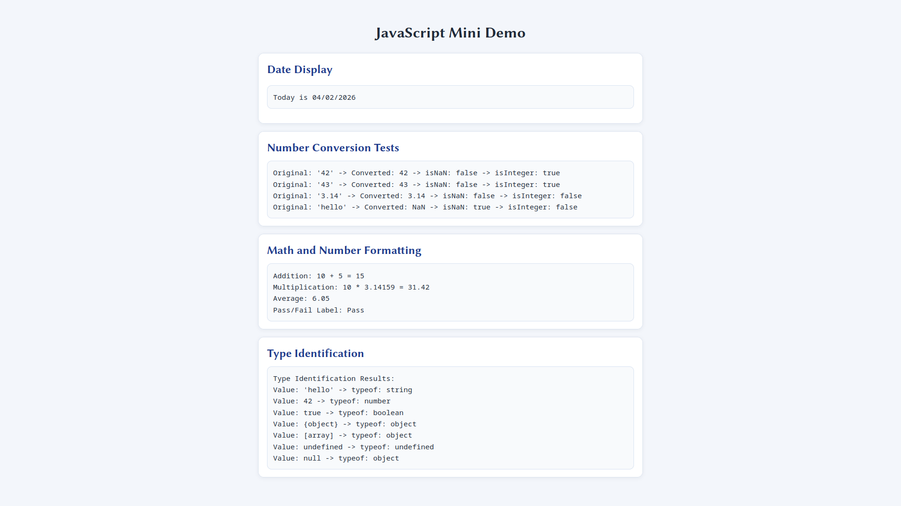
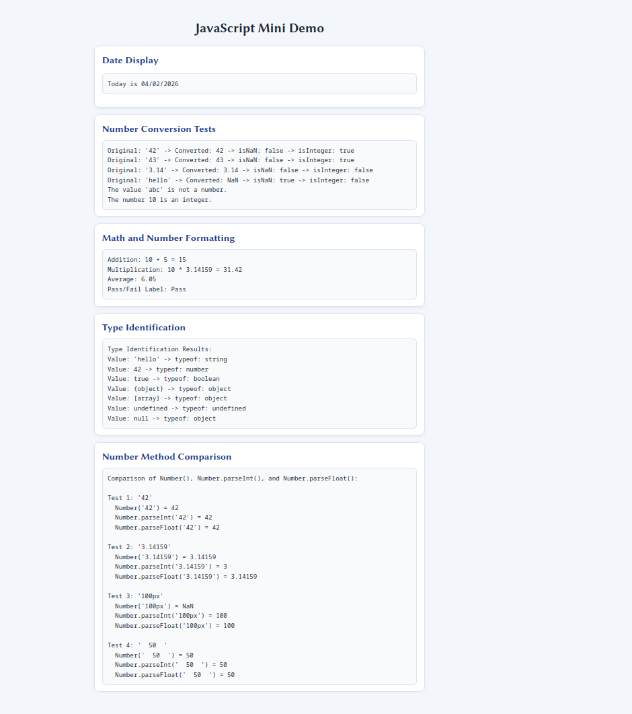

# CS484-HW9

**GitHub Pages Link:** https://sakopolis.github.io/CS484-HW9/

## Built-In Objects and Methods Used

- `Date` object: `getMonth()`, `getDate()`, `getFullYear()`
- `Number` object: `Number()`, `Number.isNaN()`, `Number.isInteger()`, `Number.parseInt()`, `Number.parseFloat()`
- `toFixed()` method for formatting decimals (this function makes floating point into fixed point)
- `typeof` operator for type identification (function to check type of variable)

## Comparison: Number() vs Number.parseInt() vs Number.parseFloat()

### Key Differences

**Number()** - Complete conversion function
- Converts the entire string to a number
- Returns `NaN` if the string contains any non-numeric characters
- Handles leading/trailing whitespace (ignores it)
- Works with decimal numbers perfectly
- Example: `Number("42.5")` → `42.5`, but `Number("42px")` → `NaN`

**Number.parseInt()** - Parses from the left
- Extracts an integer from the beginning of a string
- Stops parsing when it encounters a non-numeric character
- Ignores leading whitespace
- Returns only the integer portion (discards decimals)
- Example: `Number.parseInt("42.5")` → `42`, `Number.parseInt("100px")` → `100`

**Number.parseFloat()** - Parses floats from the left
- Similar to `parseInt()`, but preserves decimal values
- Extracts a number from the beginning of a string
- Stops parsing at the first non-numeric character (except the decimal point)
- Handles leading whitespace
- Example: `Number.parseFloat("42.5")` → `42.5`, `Number.parseFloat("100px")` → `100`

### Visual Comparison Table

| Input | Number() | parseInt() | parseFloat() |
|-------|----------|-----------|-------------|
| "42" | 42 | 42 | 42 |
| "3.14" | 3.14 | 3 | 3.14 |
| "100px" | NaN | 100 | 100 |
| "  50" | 50 | 50 | 50 |

### When to Use Each

- Use **Number()** when you need strict validation and complete conversion
- Use **Number.parseInt()** when parsing integers from strings with trailing characters
- Use **Number.parseFloat()** when parsing decimal numbers from strings with trailing characters

## Reflection

The easiest part of this assignment was Part 1 because the Date object methods are straightforward and simple. The hardest part was understanding the differences between Number conversion methods. I learned that the Date object uses 0-based months, so the month value needs to be adjusted before displaying it. I also learned that the Number object has multiple conversion methods, and each one behaves differently depending on the input format. Displaying results in the browser reinforced how JavaScript can dynamically update the DOM.

## Screenshot

## Sources

- **Assignment Specification:** COMP 484 Homework 9: JavaScript Built-In Objects
- **MDN Web Docs - Date Object:** https://developer.mozilla.org/en-US/docs/Web/JavaScript/Reference/Global_Objects/Date
- **MDN Web Docs - Date.prototype.getMonth():** https://developer.mozilla.org/en-US/docs/Web/JavaScript/Reference/Global_Objects/Date/getMonth
- **MDN Web Docs - Date.prototype.getDate():** https://developer.mozilla.org/en-US/docs/Web/JavaScript/Reference/Global_Objects/Date/getDate
- **MDN Web Docs - Date.prototype.getFullYear():** https://developer.mozilla.org/en-US/docs/Web/JavaScript/Reference/Global_Objects/Date/getFullYear
- **MDN Web Docs - Number Object:** https://developer.mozilla.org/en-US/docs/Web/JavaScript/Reference/Global_Objects/Number
- **MDN Web Docs - Number.parseInt():** https://developer.mozilla.org/en-US/docs/Web/JavaScript/Reference/Global_Objects/Number/parseInt
- **MDN Web Docs - Number.parseFloat():** https://developer.mozilla.org/en-US/docs/Web/JavaScript/Reference/Global_Objects/Number/parseFloat
- **MDN Web Docs - Number.isNaN():** https://developer.mozilla.org/en-US/docs/Web/JavaScript/Reference/Global_Objects/Number/isNaN
- **MDN Web Docs - Number.isInteger():** https://developer.mozilla.org/en-US/docs/Web/JavaScript/Reference/Global_Objects/Number/isInteger
- **MDN Web Docs - typeof Operator:** https://developer.mozilla.org/en-US/docs/Web/JavaScript/Reference/Operators/typeof
- **MDN Web Docs - Number.prototype.toFixed():** https://developer.mozilla.org/en-US/docs/Web/JavaScript/Reference/Global_Objects/Number/toFixed
- **MDN Web Docs - Conditional (Ternary) Operator:** https://developer.mozilla.org/en-US/docs/Web/JavaScript/Reference/Operators/Conditional_operator
- **MDN Web Docs - Document.getElementById():** https://developer.mozilla.org/en-US/docs/Web/API/Document/getElementById
